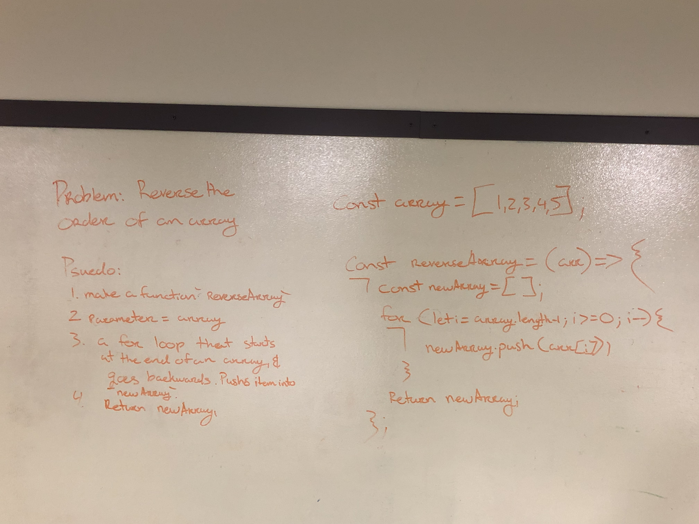

# Reverse an Array

## Challenge
Reverse the order of the array.

## Approach and Efficiency
I decided to do a for loop where I made `i` equal to the length of the array minus 1 (because arrays start at zero and .length will start at 1). Then Pushed `array[i]` into a new array. Which then is returned.

## Solution
<!--  -->